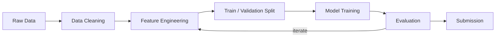

# Kaggle Project: COMPETITION_NAME

> **Competition:** [COMPETITION_NAME](https://www.kaggle.com/competitions/COMPETITION_NAME)
> **Goal:** Describe the objective here.
> **Metric:** Evaluation metric (e.g., accuracy, RMSE, AUC).

## Pipeline



## Quick Start

```bash
# 1. Clone this repo
gh repo clone benoit-bremaud/kaggle-COMPETITION_NAME

# 2. Setup environment
make setup

# 3. Start working
make notebook
```

## Project Structure

```
.
├── data/
│   ├── raw/              # Original competition data (gitignored)
│   └── processed/        # Cleaned/transformed data (gitignored)
├── notebooks/
│   └── notebook.ipynb    # Main analysis notebook
├── src/
│   ├── __init__.py
│   └── utils.py          # Reusable helper functions
├── outputs/
│   ├── models/           # Saved models (gitignored)
│   └── submissions/      # Submission CSVs + log
├── .pre-commit-config.yaml
├── Makefile              # Automation commands
├── setup.sh              # Environment setup script
├── requirements.txt      # Python dependencies
└── pyproject.toml        # Project config + ruff settings
```

## Available Commands

| Command | Description |
|---|---|
| `make setup` | Install dependencies, configure hooks |
| `make notebook` | Launch Jupyter Lab |
| `make lint` | Check code quality with ruff |
| `make format` | Auto-format code with ruff |
| `make clean` | Remove temporary files |
| `make data COMPETITION=name` | Download competition data via Kaggle API |
| `make submit COMPETITION=name FILE=path` | Submit predictions via Kaggle API |

## Workflow Checklist

For the full workflow, see [WORKFLOW.md](../WORKFLOW.md). Here is the quick reference:

### Setup (one-time)

- [ ] Repo created from template
- [ ] `make setup` — environment ready
- [ ] Data downloaded to `data/raw/`
- [ ] Branch protection configured (PR + CI required)
- [ ] Labels created in repo
- [ ] 5 standard issues created (EDA → Cleaning → Features → Model → Submission)
- [ ] Issues added to Kaggle project board
- [ ] Notebook header + config updated for this competition
- [ ] README.md updated with competition details

### Per-step (repeat for each issue)

- [ ] `git checkout -b feat/{step-name}`
- [ ] Code with WHY comments
- [ ] `make lint` passes
- [ ] `pytest tests/ -v` passes
- [ ] Kernel → Restart & Run All
- [ ] Commit → Push → PR (assignee, labels, project, `Closes #X`)
- [ ] CI green → merge → post-merge cleanup

### Submission

- [ ] Retrain on 100% training data
- [ ] Validate CSV format against sample submission
- [ ] Submit to Kaggle
- [ ] Log both scores (CV + LB) in `outputs/submissions/log.md`

## Decisions

See [DECISIONS.md](DECISIONS.md) for project-specific architectural decisions.
See the [global DECISIONS.md](../DECISIONS.md) for decisions that apply to all Kaggle projects.

## License

[MIT](LICENSE)
